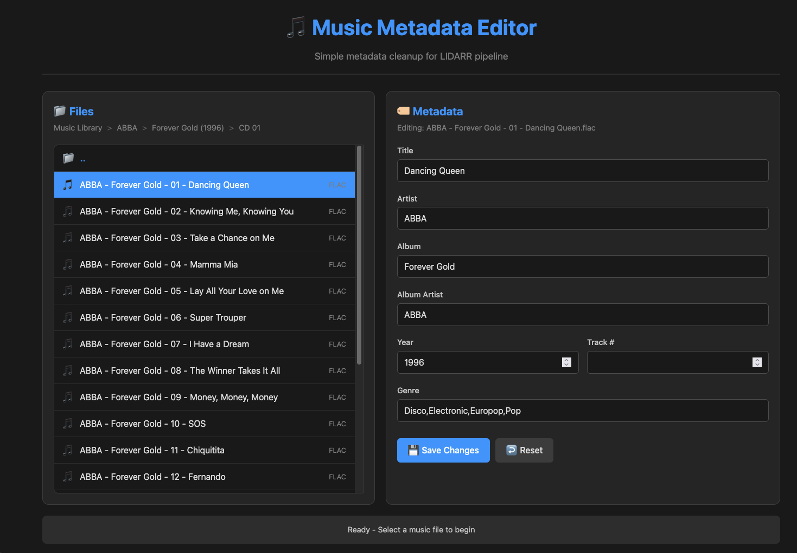

# 🎵 Music Metadata Editor

**Production-ready web-based music file metadata editor for LIDARR pipeline integration**


## 📸 Screenshots



*Clean two-panel interface showing file browser and metadata editor*

## 🎯 What It Does

A complete file management and metadata editing solution designed for music library automation:

### **Core Features**
- 🗂️ **Full directory browsing** with intuitive navigation
- 🎵 **Metadata reading/editing** for all major audio formats
- 🖱️ **Multi-select operations** with Ctrl+click
- 📝 **Batch metadata editing** across multiple files
- 🔄 **File & directory operations** (rename, delete, organize)
- 🍞 **Breadcrumb navigation** with right-click context menus
- 🎨 **Dark theme interface** optimized for extended use

### **Advanced Operations**
- **Context menus** on files, directories, and breadcrumbs
- **Smart navigation** that prevents accidental directory changes
- **Scroll position memory** when navigating between folders
- **Comprehensive safety warnings** for destructive operations
- **Real-time form validation** and error handling

## 🚀 Quick Start

```bash
# Clone and run with Docker
git clone https://github.com/yourusername/music-metadata-editor.git
cd music-metadata-editor

# Build and run
docker build -t music-metadata-editor .
docker run -p 3000:3000 -v /path/to/your/music:/music music-metadata-editor

# Access the web interface
open http://localhost:3000
```

## 🏗️ Architecture

- **Backend**: Node.js + Express + music-metadata library
- **Frontend**: Vanilla JavaScript (no frameworks - fast and reliable)
- **Deployment**: Docker container with volume mounting
- **Design**: Responsive dark theme with two-panel layout

## 📁 Project Structure

```
music-metadata-editor/
├── src/app.js              # Express server + API endpoints
├── public/
│   ├── index.html          # Main interface
│   ├── css/style.css       # Dark theme styling
│   └── js/app.js           # Frontend application
├── Dockerfile              # Container configuration
└── docker-compose.yml     # Easy deployment
```

## 🎮 How To Use

### **File Navigation**
- **Single click**: Select files or navigate directories
- **Ctrl+click**: Multi-select files for batch operations
- **Right-click**: Access context menus for rename/delete
- **Breadcrumbs**: Click to jump to any parent directory

### **Metadata Editing**
- **Single file**: Edit all metadata fields
- **Multiple files**: Batch edit common fields (Artist, Album, etc.)
- **Auto-save**: Press Enter in any field to save immediately
- **Reset**: Restore original values if needed

### **File Operations**
- **Rename**: Right-click files/folders → Rename
- **Delete**: Comprehensive warnings for safety
- **Batch delete**: Select multiple items → Right-click → Delete Selected

## 🔧 API Endpoints

```
GET  /api/files?path=<path>     # Browse directories
GET  /api/metadata/<path>       # Read file metadata
POST /api/metadata/<path>       # Update metadata (stubbed)
POST /api/file/rename           # Rename files
POST /api/directory/rename      # Rename directories  
POST /api/file/delete           # Delete files
POST /api/directory/delete      # Delete directories
POST /api/batch/delete          # Batch delete operations
```

## 🎵 Supported Formats

- **FLAC** - Full metadata support
- **MP3** - ID3v1 and ID3v2 tags
- **M4A/AAC** - MP4 container metadata
- **OGG** - Vorbis comments
- **WAV** - Basic metadata support

## 🛠️ Development

```bash
# Local development setup
npm install
npm start

# Access at http://localhost:3000
# Backend will serve files from /music directory
```

## 📋 LIDARR Pipeline Integration

Perfect for music library automation workflows:

```
[Music Sources] → [Metadata Editor] → [LIDARR] → [Organized Library]
                       ↑
                  Clean up metadata
                  before processing
```

## ⚠️ Current Status

- ✅ **File browsing**: Complete and tested
- ✅ **Metadata reading**: All formats supported  
- ✅ **UI/UX**: Fully functional interface
- ✅ **File operations**: Rename, delete, organize
- ⏳ **Metadata writing**: UI complete, backend stubbed

*Note: Metadata writing returns success but doesn't modify files yet. Adding format-specific writing libraries is the next step.*

## 🚢 Deployment Options

### **Docker (Recommended)**
```bash
docker run -d \
  --name music-editor \
  -p 3000:3000 \
  -v /path/to/music:/music \
  music-metadata-editor
```

### **Docker Compose**
```yaml
version: '3.8'
services:
  music-editor:
    build: .
    ports:
      - "3000:3000"
    volumes:
      - /path/to/music:/music
    restart: unless-stopped
```

## 🤝 Contributing

Built through iterative development with real-world testing. Contributions welcome for:
- Metadata writing implementation
- Additional audio format support
- Performance optimizations
- Feature enhancements

## 📄 License

MIT - Built for the community, use however you need.

---

## 🎉 Credits

*"Few hours of vibe-coding" that turned into a production-ready tool.*

Created for LIDARR pipeline integration and music library management. Perfect for homelabs, media servers, and anyone who needs clean metadata before automated processing.
